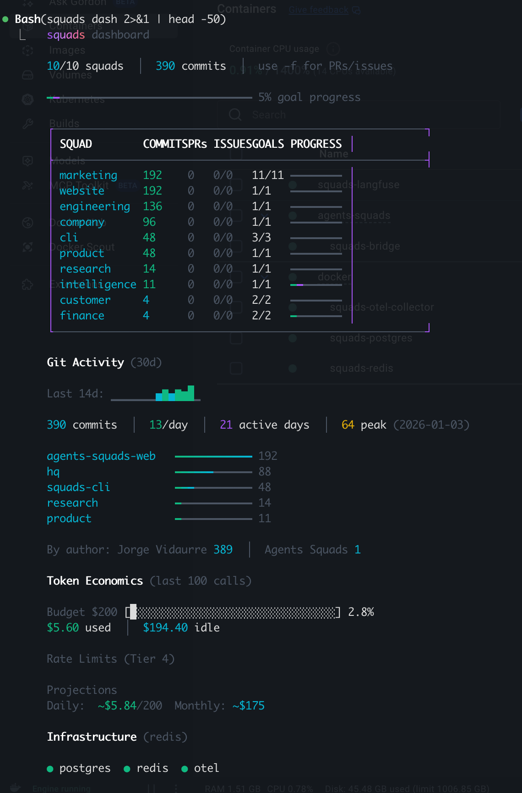

<div align="center">

# squads

**Your AI workforce**

One person + AI teammates = a real business.

[](https://www.npmjs.com/package/squads-cli)
[](https://www.npmjs.com/package/squads-cli)
[](LICENSE)
[](https://nodejs.org)
[](https://github.com/agents-squads/squads-cli)

[Documentation](https://agents-squads.com/docs) · [Getting Started](https://agents-squads.com/onboarding) · [Architecture](https://agents-squads.com/engineering/squads-architecture)

</div>

---

Squads organizes AI agents into domain-aligned teams -- marketing, engineering, finance, operations -- that coordinate work, remember what they learn, and track goals over time. Agents are plain markdown files. No framework lock-in, no proprietary formats. Works with any LLM provider.



## Quick Start

```bash
npm install -g squads-cli
squads init
```

```
$ squads status

  squads status
  ● 3 active sessions across 2 squads (claude 2, gemini 1)

  4/4 squads  |  memory: enabled

  SQUAD           AGENTS  MEMORY        ACTIVITY
  engineering     3       4 entries     today
  marketing       2       2 entries     today
  research        5       1 entry       yesterday
  operations      2       --            3d ago
```

```bash
# Run a specific agent
squads run engineering/code-review

# Run an entire squad in parallel
squads run engineering --parallel

# Search across all agent memory
squads memory query "authentication patterns"

# Set and track goals
squads goal set engineering "Ship v2.0 by Friday"
squads dash
```

## Why Squads

**Agents are markdown files.** No DSLs, no YAML pipelines, no SDKs. A squad is a directory. An agent is a `.md` file with a role, model preference, and instructions. You own everything -- version it, edit it, fork it.

**Multi-provider by default.** Route agents to the right model for the job. Claude for deep reasoning, Gemini for speed, GPT-4o for breadth, Ollama for local execution. Switch providers per agent or per run with a single flag.

**Memory that persists.** Agents accumulate knowledge across sessions. Learnings survive restarts, context carries forward, and any agent can search the collective memory of the organization.

**Goals, not just tasks.** Set objectives at the squad level, track progress through KPIs, and get executive summaries. Squads is a business operating system, not a script runner.

## Supported Providers

| Provider | CLI | Models |
|----------|-----|--------|
| Anthropic | `claude` | Opus, Sonnet, Haiku |
| Google | `gemini` | Gemini 2.5 Flash, Pro |
| OpenAI | `codex` | GPT-4o, o1, o3 |
| Mistral | `vibe` | Large, Medium |
| xAI | `grok` | Grok |
| Aider | `aider` | Multi-model |
| Ollama | `ollama` | Any local model |

```bash
# Use a specific provider for a run
squads run research --provider=google --model=gemini-2.5-flash

# Check which providers are available
squads providers
```

## Features

### Dashboard

Full visibility into squad activity, goal progress, and git contribution metrics.

```
$ squads dash

  squads dashboard
  ● 7 active sessions across 3 squads

  8/10 squads  |  404 commits  |  use -f for PRs/issues

  ━━━━━━━━━━━━━━━━━━━━━━━━━━━━━━━━ 35% goal progress

  SQUAD        COMMITS PRs ISSUES GOALS  PROGRESS
  marketing    203     0   0/0    9/12   ━━━━━━━━
  engineering  139     0   0/0    0/1    ━━━━━━━━
  cli          48      0   0/0    2/3    ━━━━━━━━

  Git Activity (30d)
  Last 14d: ▁▁▁▁▁▁▁▄▆▄▆▅█▂
  404 commits  |  13.5/day  |  21 active days
```

The `--ceo` flag produces an executive summary with P0/P1 priorities and spend tracking.

### Memory System

Agents write learnings as they work. The memory system makes that knowledge searchable and shareable across the organization.

```bash
# Capture a learning from the command line
squads memory write engineering "Redis connection pooling requires min 5 connections for our load"

# Search all agent memory
squads memory query "deployment"

# View a specific squad's accumulated knowledge
squads memory read engineering
```

### Session Detection

Automatically detects running AI coding sessions across your machine and maps them to squads based on working directory.

```
$ squads sessions

  ● 4 active sessions
  claude  engineering/backend    ~/projects/api         12m
  claude  engineering/frontend   ~/projects/web         3m
  gemini  research/analyst       ~/projects/research    45m
  cursor  marketing/content      ~/projects/site        8m
```

Supports: Claude Code, Cursor, Aider, Gemini, GitHub Copilot, Sourcegraph Cody, Continue.

### Autonomous Execution

Two scheduling systems are available depending on how much control you need:

**Autonomous daemon** — simple cron-style local scheduler:

```bash
squads autonomous start    # Start the daemon
squads autonomous status   # Check what's running
squads autonomous stop     # Stop the daemon
squads autonomous pause    # Pause without stopping
squads autonomous resume   # Resume a paused daemon
```

**Autopilot** — intelligent scheduler with budget control and adaptive dispatch:

```bash
# Run every 30 minutes, cap spend at $50/day
squads autopilot --interval 30 --budget 50

# Run up to 3 squads in parallel
squads autopilot --parallel 3

# Preview one cycle without executing
squads autopilot --once --dry-run
```

Use `autonomous` when you want simple cron-like scheduling. Use `autopilot` when you want the system to watch squad state, decide what to run, learn from results, and enforce budget limits.

### Claude Code Integration

Add hooks to `.claude/settings.json` so every Claude Code session starts with squad context:

```json
{
  "hooks": {
    "SessionStart": [{
      "hooks": [{
        "type": "command",
        "command": "squads status",
        "timeout": 10
      }, {
        "type": "command",
        "command": "squads memory sync --no-push",
        "timeout": 15
      }]
    }],
    "Stop": [{
      "hooks": [{
        "type": "command",
        "command": "squads memory sync --push",
        "timeout": 15
      }]
    }]
  }
}
```

> Run `squads init` to set this up automatically.

## Commands

### Core

| Command | Description |
|---------|-------------|
| `squads init` | Initialize project with manager agent and starter squads |
| `squads create <name>` | Create a new squad |
| `squads list` | List agents and squads |
| `squads run <target>` | Run a squad or specific agent |
| `squads orchestrate <squad>` | Run squad with lead agent orchestration |
| `squads version` | Show version information |

### Monitoring

| Command | Description |
|---------|-------------|
| `squads status [squad]` | Squad overview and active sessions |
| `squads dash [name]` | Dashboard with goals, metrics, and git activity |
| `squads sessions` | Active AI coding sessions |
| `squads session` | Manage current session lifecycle |
| `squads stats [squad]` | Agent outcome scorecards |
| `squads exec` | View execution history and statistics |
| `squads results [squad]` | Git activity + KPI goals vs actuals |
| `squads history` | Recent execution history |
| `squads cost` | Cost summary by squad and time period |
| `squads health` | Infrastructure health check |
| `squads doctor` | Check local tools, auth, and readiness |

### Memory & Learning

| Command | Description |
|---------|-------------|
| `squads memory query <q>` | Search across all agent memory |
| `squads memory write <squad> <insight>` | Persist a learning |
| `squads memory read <squad>` | View squad memory |
| `squads memory sync` | Synchronize memory with git remote |
| `squads learn <insight>` | Quick-capture a learning |
| `squads learnings` | View and search learnings |

### Goals & KPIs

| Command | Description |
|---------|-------------|
| `squads goal set <squad> <goal>` | Set a squad objective |
| `squads goal list` | View all goals and progress |
| `squads kpi show <squad>` | Track squad KPIs |
| `squads progress` | Track active and completed tasks |

### Automation

| Command | Description |
|---------|-------------|
| `squads autonomous start` | Start local cron-style scheduling daemon |
| `squads autopilot` | Full autopilot: watch, decide, dispatch, learn |
| `squads autonomy` | Show autonomy score and confidence metrics |
| `squads cognition` | Business cognition engine — beliefs, decisions, reflections |
| `squads trigger` | Smart triggers for event-driven execution |
| `squads approval` | Manage approval requests |

### Configuration

| Command | Description |
|---------|-------------|
| `squads providers` | List available LLM providers |
| `squads env show <squad>` | View squad execution environment |
| `squads context` | Business context for agent alignment |
| `squads detect-squad` | Detect current squad based on working directory |
| `squads deploy` | Deploy agents to the Squads platform |
| `squads eval <target>` | Evaluate agent readiness |
| `squads sync` | Sync memory state to Postgres |
| `squads update` | Check for and install updates |

### Auth

| Command | Description |
|---------|-------------|
| `squads login` | Authenticate with Squads platform |
| `squads logout` | Sign out |
| `squads whoami` | Show current auth identity |

Run `squads --help` for the full command reference, or `squads <command> --help` for detailed options.

## Project Structure

After `squads init`, your project gets a `.agents/` directory:

```
your-project/
├── .agents/
│   ├── squads/                  # Squad definitions
│   │   ├── engineering/
│   │   │   ├── SQUAD.md         # Squad config, goals, KPIs
│   │   │   ├── code-review.md   # Agent: role, model, instructions
│   │   │   └── backend.md       # Agent: another team member
│   │   └── marketing/
│   │       ├── SQUAD.md
│   │       └── content.md
│   ├── memory/                  # Persistent state (auto-managed)
│   │   ├── engineering/
│   │   └── marketing/
│   └── outputs/                 # Agent work products
└── CLAUDE.md                    # Optional: project-level AI context
```

Everything is plain text. Version it with git, review it in PRs, edit it in any editor.

## Configuration

### Agent Definition

Each agent is a markdown file with YAML frontmatter:

```markdown
---
model: sonnet
provider: anthropic
effort: high
timeout: 30
---

# Code Review Agent

You review pull requests for correctness, security, and style.

## Instructions
- Check for common vulnerability patterns
- Verify test coverage for new code paths
- Flag any breaking API changes
```

### Squad Definition

`SQUAD.md` configures the team:

```markdown
---
agents:
  - code-review
  - backend
  - frontend
model: sonnet
provider: anthropic
---

# Engineering Squad

Owns the codebase. Ships features, fixes bugs, maintains quality.

## Goals
- P0: Ship v2.0 release
- P1: Reduce CI build time below 3 minutes
```

## Development

```bash
git clone https://github.com/agents-squads/squads-cli.git
cd squads-cli
npm install
npm run build
npm link           # Makes 'squads' available globally
npm test
```

### Tech Stack

- **TypeScript** (strict mode) with **Commander.js** for CLI parsing
- **Vitest** for testing
- **tsup** for bundling
- Built on the [Anthropic SDK](https://github.com/anthropics/anthropic-sdk-node) with multi-provider abstraction

## Contributing

Contributions are welcome. Please open an issue first to discuss what you'd like to change.

1. Fork the repository
2. Create your branch (`git checkout -b feature/my-feature`)
3. Commit your changes (`git commit -m 'Add my feature'`)
4. Push to the branch (`git push origin feature/my-feature`)
5. Open a Pull Request

See [CONTRIBUTING.md](CONTRIBUTING.md) for detailed guidelines.

## Community

- [GitHub Issues](https://github.com/agents-squads/squads-cli/issues) -- Bug reports and feature requests
- [GitHub Discussions](https://github.com/agents-squads/squads-cli/discussions) -- Questions and ideas
- [Documentation](https://agents-squads.com/docs) -- Guides, tutorials, and API reference

## Related Projects

- [agents-squads](https://github.com/agents-squads/agents-squads) -- The full framework
- [engram](https://github.com/agents-squads/engram) -- Persistent memory for AI agents (MCP server)

## License

[MIT](LICENSE)

---

<div align="center">

Built by [Agents Squads](https://agents-squads.com)

</div>
