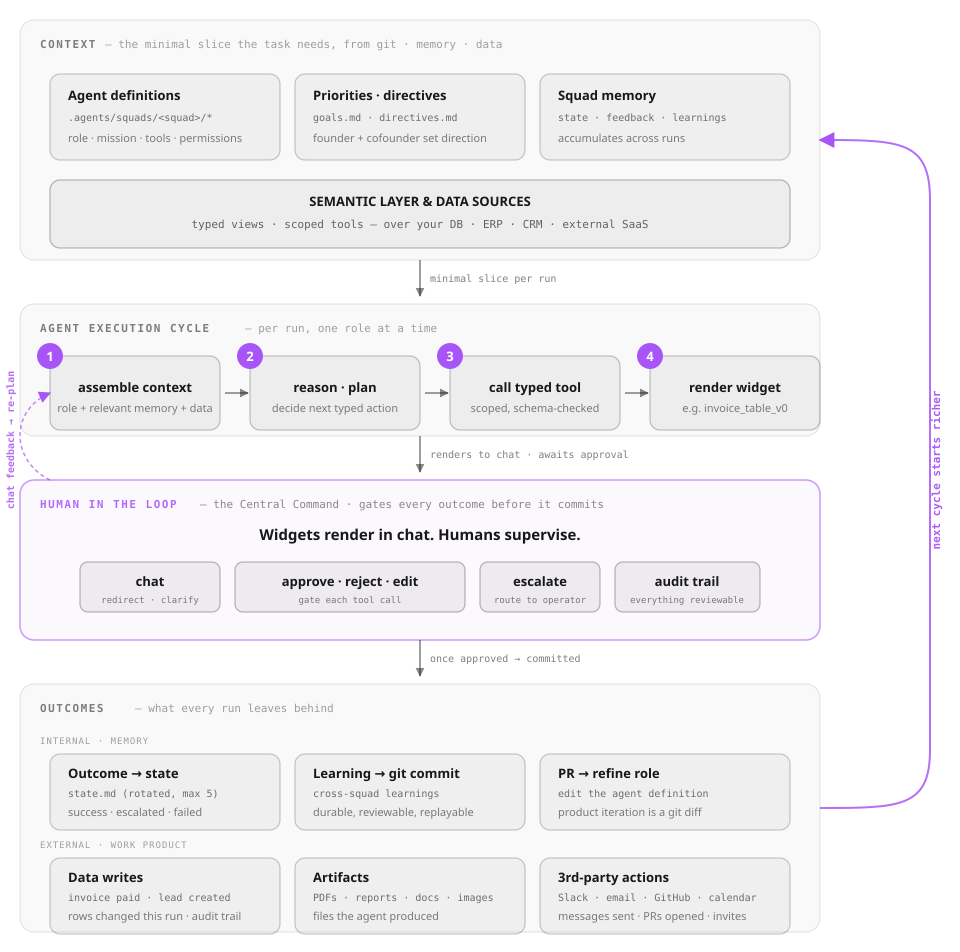

# Architecture

How Squads works under the hood: files, context, roles, and the feedback loop.

## Everything is a file

There's no database, no server, no runtime to manage. Your entire AI
workforce lives in a single `.agents/` directory that you commit to git
like any other code. This means you get version history, code review,
branching, and merge — applied to your agent definitions and
organizational memory.

```
.agents/
├── BUSINESS_BRIEF.md          # Business context (primary source)
├── config/
│   └── SYSTEM.md              # Base behavior (shared across all agents)
├── squads/
│   ├── intelligence/
│   │   ├── SQUAD.md            # Squad identity, goals, KPIs
│   │   ├── scanner.md          # Agent definition
│   │   └── analyst.md          # Agent definition
│   ├── research/
│   │   ├── SQUAD.md
│   │   └── analyst.md
│   ├── product/
│   │   ├── SQUAD.md
│   │   └── scanner.md
│   └── company/
│       ├── SQUAD.md
│       └── evaluator.md        # COO — evaluates all squad outputs
└── memory/                     # Persistent state (auto-managed)
    ├── intelligence/
    ├── research/
    ├── product/
    └── company/
```

A squad is a directory. An agent is a markdown file. Edit in vim, review in
a PR, diff in git. No YAML pipelines, no JSON schemas, no DSLs.

The three top-level directories serve distinct purposes: `config/` holds
immutable rules that every agent follows regardless of squad. `squads/`
holds identity — who each agent is, what it produces, how it behaves.
`memory/` holds state — what agents have learned, what they're working on,
what feedback they've received. Identity is stable. Memory evolves.

## Context Cascade

The biggest problem with autonomous agents isn't capability — it's
context. An agent that doesn't know what's already been done will
duplicate work. An agent that doesn't know the company strategy will
optimize for the wrong thing. An agent that doesn't know its own last
output was rated as noise will keep producing noise.

Squads solves this by loading a layered context cascade before every
execution, in strict priority order:

| # | Layer | Source | Purpose |
|---|-------|--------|---------|
| 0 | System Protocol | `config/SYSTEM.md` | Immutable rules every agent follows |
| 1 | Company Strategy | `memory/company/strategy.md` | Company identity and strategic direction (falls back to `company.md` → `directives.md`) |
| 2 | Goals | `memory/{squad}/goals.md` | Measurable targets for this squad |
| 3 | Active Work | `memory/{squad}/active-work.md` | Open PRs and issues — prevent duplication |
| 4 | Agent State | `memory/{squad}/{agent}/state.md` | What the agent already knows |
| 5 | Feedback | `memory/{squad}/feedback.md` | Last cycle evaluation |
| 6 | Briefings | `memory/daily-briefing.md` | Cross-squad context |

The order matters. When the token budget runs out, lower layers drop
first. An agent that loses briefings still knows its mission and what
work exists. An agent that loses its identity is useless. The cascade
ensures graceful degradation — the most critical context always loads.

## Role-Based Depth

Not every agent needs the same depth of context. A scanner looking for
new opportunities doesn't need to know the company's strategic directives
or what feedback other agents received. A lead coordinating across squads
needs everything. Loading unnecessary context wastes tokens and can
confuse the agent with irrelevant information.

- **Scanners** get company strategy, goals, and their own state — they discover, don't decide
- **Workers** add feedback and active work — they execute with awareness of what exists
- **Leads** get all layers including cross-squad briefings — they orchestrate with full visibility
- **Evaluators** get all layers with org-wide summaries — they assess and generate feedback

## Goals and Strategy

A common failure mode in autonomous systems is conflating direction with
execution. An agent that only sees "Fix #461 this week" doesn't know
*why* that matters or what the bigger picture is. An agent that only sees
"Build the best developer experience" has no idea what to work on today.

Squads separates aspiration from execution:

- **Strategy** lives in `memory/company/strategy.md` — company identity and the "why" behind all work
- **Goals** live in `memory/{squad}/goals.md` — measurable targets with deadlines and status tracking

Strategy gives agents purpose and alignment. Goals give them specific, measurable targets.
`squads goal set` writes aspirational goals. Strategy is updated by the founder between cycles.

## Phase Ordering

In a real organization, the research team finishes their analysis before
the product team writes the roadmap. The finance team closes the books
before the CEO reviews performance. Order matters — and when agents
execute in the wrong order, they work with stale or missing information.

Squads declare dependencies in their SQUAD.md frontmatter:

```yaml
---
name: product
depends_on: [intelligence, research]
---
```

The CLI computes execution phases via topological sort. Squads with no
dependencies run first. Squads with `depends_on: ["*"]` run last
(evaluation). Within each phase, squads run in parallel.

## Execution Containment

Knowing the right things (the cascade) is half of trust; the other half
is bounding what a run can touch. Every squad run is contained:

- **Worktree isolation** — each run executes in its own git worktree, cut
  from the trunk. Agents never edit your working copy; deliverables arrive
  as branches and PRs, not loose changes.
- **Nothing is silently lost** — if a run dies mid-work (timeout, quota,
  crash), uncommitted deliverables are auto-committed to a
  `squads/run-*` salvage branch and surfaced in the inbox as PARTIAL.
- **OS sandbox** — agent processes run inside the operating system's
  sandbox by default, with an egress allowlist.
- **Bounds** — per-role timeouts, per-run budget caps, and conversation
  turn limits are enforced by the runner, not requested politely.
- **The agent contract** — each agent's declared permissions compile to
  an enforced tool allowlist at spawn (see `agent-contract.md`).

## Bounded Task Dispatch

The workhorse mode for scoped work is a task, not a conversation:

```bash
squads run engineering --task "Fix #593 — spec in the issue" -t 40
```

A `--task` run gets a lead+delegate roster (not the full squad), a hard
timeout, and a **PR-gate stop**: the run converges when the deliverable
exists as a pull request, then stops. One task, one branch, one PR —
drift is prevented by the mode, not by agent discipline.

## The Feedback Loop

This is the core of Squads — a closed loop that runs through a human gate:

<picture>
  <source media="(prefers-color-scheme: dark)" srcset="assets/execution-loop-dark.svg">
  
</picture>

Each run assembles the minimal context slice its task needs, executes
inside containment, and produces artifacts. Then two things close the loop:

**The decision gate.** `squads inbox` lists everything waiting on a human
— PRs from runs, salvaged PARTIAL branches, proposals. `approve` executes
the item's stated semantics (for a PR: the CI-gated auto-merge; with no
GitHub remote: a local squash-merge to your trunk). `reject` archive-tags
before deleting, so nothing is unrecoverable, and writes the reason
through to feedback. Every decision lands in an append-only
`reviewed.jsonl` ledger with `by:` attribution — autonomous actors stamp
themselves, never a human who didn't look.

**Measured feedback.** Runs emit a typed event stream (watch live with
`squads watch`, replay after). Outcomes are captured — not "did the agent
say done" but did the work *land* (merged, deployed, delivered). The
evaluator writes `feedback.md` per squad, injected into the next cycle;
`squads feedback` records human ratings; and the scoreboard ranks
executors by quality-per-cost from real outcomes, feeding dispatch
decisions.

Autopilot mode (`squads run` with no target) uses these evaluations to
determine which squads to run next, in what order, with what budget. The
full loop: dispatch → contained execution → artifacts through the gate →
measured outcomes → richer context → dispatch again.

## Initiative

Squads don't only respond — they extend. `squads propose` runs one
bounded background pass that turns repo intent (README, commits, your
product's trajectory) into a draft deliverable on a proposal branch plus
an inbox card. The intent scanner keeps `BUSINESS_BRIEF.md` fresh from
repo deltas so proposals track what you're actually building. Nothing
lands without your approval — initiative is always behind the gate.
